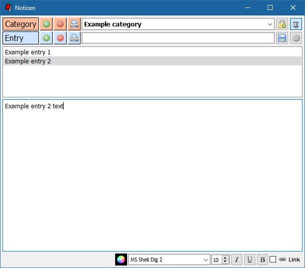

# 1. Introduction

This program is a note-taking application written in Qt.
It allows you to easily create, delete, print and modify notes. Notes are grouped into categories. Encrypted, password protected categories may be created for sensitive data.

The interface is hopefully intuitive enough for most users. This readme nonetheless provides a comprehensive description of all the features.

# 2. Basics: Categories and entries

## Creating categories and entries

To create a category, type its desired name into the combo box (at the same level as the "Category" label), and either press return or click the "+" button on the same level.
Similarly, to create an entry, type its desired name into the text field on a level with the "Entry" label, press return or click the associated "+" button. The text field is also used to search for entries.

## Searching and selecting entries

Type part of the name of an entry you wish to select into the text field which is on a level with the "Entry" label.
The list below will always show entries whose name contains the search-text. They are listed in the following order: Entries which begin like the search-text go first, in alphabetical order. Entries which don't, but nonetheless match the search-text go second, again in alphabetical order.
To select an entry, click on it in the list, or navigate the list with the arrow keys.

## Editing entries

The big textbox at the bottom of the window always shows the content of the entry currently selected. To edit an entry, make changes in the textbox and either click the "save" button in the top right (floppy disk icon), or press ctrl+s.
At the bottom of the window, you will find some of the usual elements of a text editor, allowing you to adjust font settings (color, font family, point size, italic, underline, bold).
If you wish to include a clickable URL in your note, there are 3 ways of going about it:
1. Just type in the URL, select it in the text (take care not to include any neighboring whitespaces) and check the "Link" checkbox in the bottom right. You now have a clickable link.
2. Type in whatever you'd like to be the name of the link, select it in the text, right click on it and click "Edit URL". Enter the desired URL. The selected text should now be clickable and lead to the specified URL.
Some URLs (those not beginning with "www") might require "http://" or "https://" to work.
3. Drag the URL (e.g. from the address bar of your browser) into the textbox.

## Deleting categories and entries

There are 2 ways to delete a category (and all entries therein):
1. Select it (if it's not currently selected) and click on the "-" button for categories.
2. Select it and right click on it, click "Delete category" in the context menu.

For entries there are 3 ways:
1. By selecting it and using the "-" button for entries.
2. By right clicking on it in the list and selecting "Delete entry" from the menu.
3. By selecting it and pressing the delete key.

## Printing categories and entries

If you wish to print the contents of an entry or a whole category, press the associated "print" buttons in the top left.

# 3. Encryption

## Using encryption

To enable encryption, click the "lock" button in the top right. If no password is set, you will be asked to create one. If a password was already set, you need to enter it to proceed.
While encryption is enabled, all newly created categories will be encrypted and cannot be decrypted without your password. In the combo box, encrypted categories are distinguished by a lock icon. All of the entries within an encrypted category are encrypted.
Newly created entries are encrypted depending on whether the currently selected category is encrypted.
To disable encryption, press the "lock" button again. Encrypted categories now no longer show up in the combo box.

## Technical aspects

The library used for all encryption capabilities is crypto++ (https://www.cryptopp.com/) or QCA (https://github.com/KDE/qca).

Entries are encrypted with AES256 in CBC mode with random (128 bit) initialization vectors and a 256 bit master key, which is randomly generated when the password is first set.
PBKDF2-SHA1 is used to derive a 512 bit key from the password plus a random salt (256 bits). The first 256 bits serve as an intermediate key to encrypt the master key, again using a random initialization vector. The SHA1-hash of the second 256 bits is used for password verification.
The encrypted master key resides in ./enc/masterkey (relative to the application path). The initialization vector, random salt and SHA1-hash are also stored there.
Encrypted entry files lead with their respective initialization vectors.

## Warning

./enc/masterkey must not be deleted or altered, otherwise all of your encrypted categories will become inaccessible, even if you remember the password.

## Changing the password

A new password may be set from the settings window ("cog wheel" button in the top right) in the "Encryption" tab.

# 4. Settings

The settings window is accessible by the "cog wheel" button in the top right.

## Entries and printing tab

Default font settings for the entry text editor can be set here. If you wish to alter all existing entries (this includes encrypted ones only if encryption is currently on), check the boxes next to the font settings you want to apply everywhere.
Headings containing the name of the category or entry will be printed using the font settings under "printing" (entry contents are printed exactly as they are in the editor field). By default they are underlined.
Click "Apply" to put your changes into effect. Click "Reset", then "Apply" to revert to default settings.

## User interface tab

Here you may set the language, starting position of the main window, default category and several font settings pertaining to various parts of the interface. Try them out to see the effects.
You can also decide whether you want the window to stay on top by default.
The main window remembers its size from the last time you launched the application. To reset it to the default, click "Reset window dimensions".
Click "Apply" to put your changes into effect. Click "Reset", then "Apply" to revert to default settings.

## Encryption tab

Here you may change your password if one is currently set, or else create a new password.

# 5. Credits

The application was developed by me, Jan Henkel (https://github.com/jan-henkel).
The icons are mostly from the "Silk" icon set by Mark James (http://www.famfamfam.com/lab/icons/silk/), aside from the 'stay on top' pin icon and the application's notepad icon, which were drawn by me.
